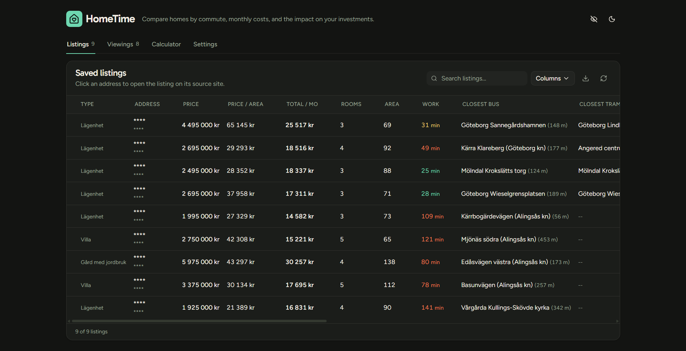
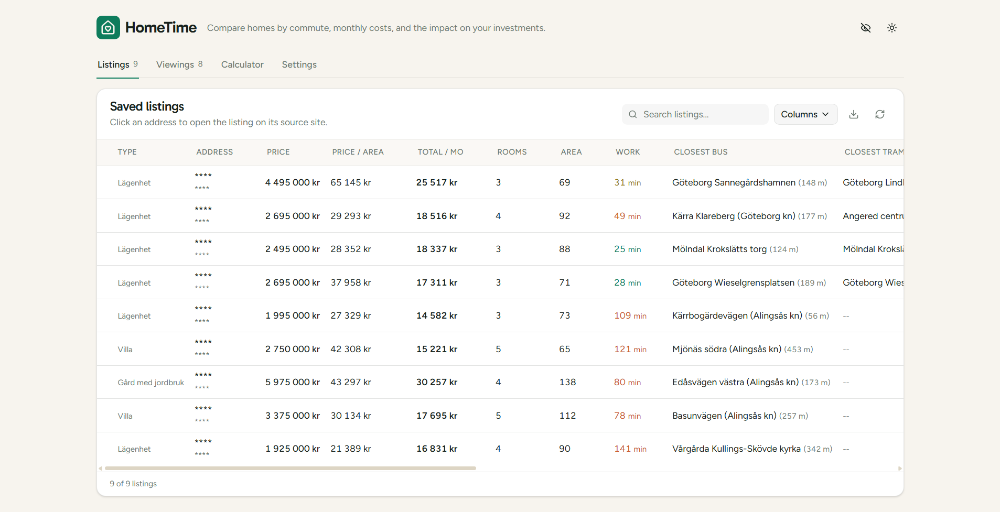
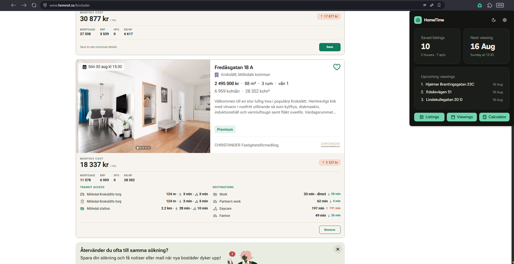
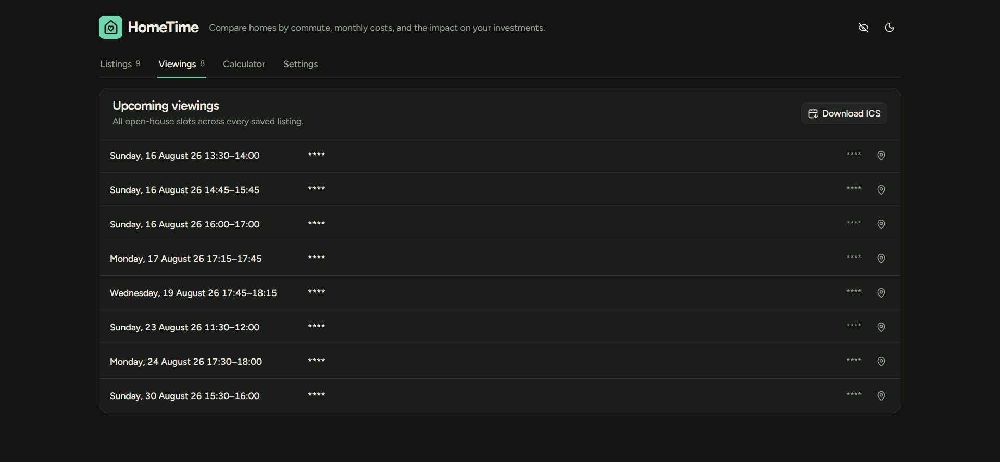
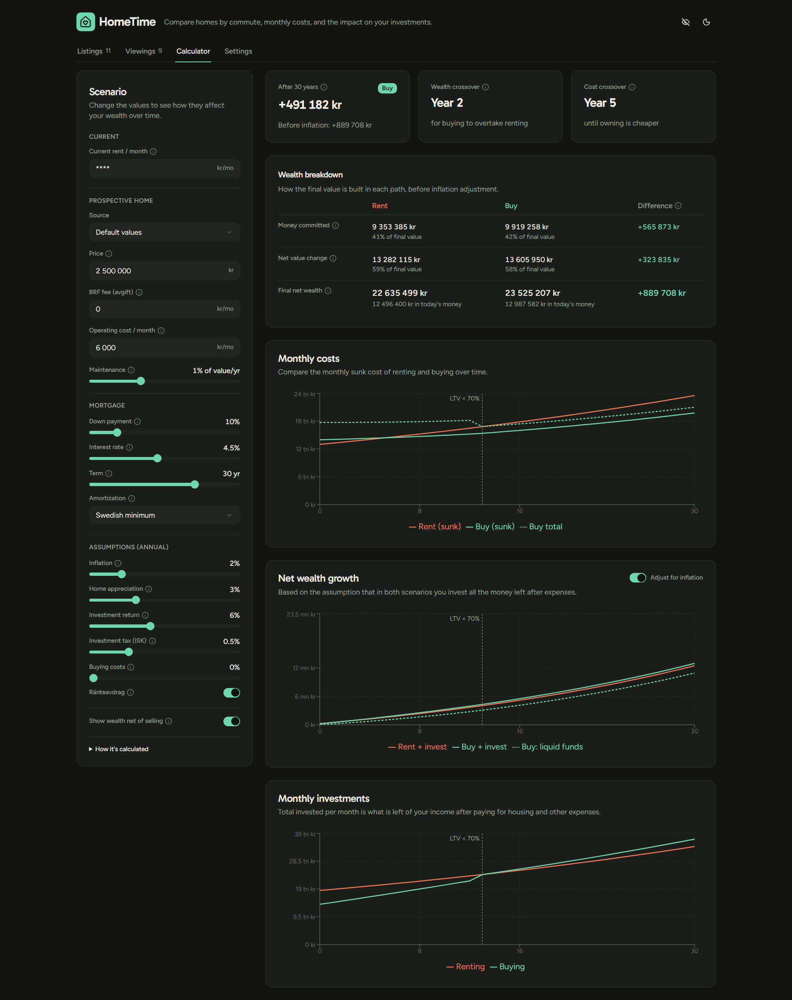

I made this because I'm trying to find my dream home (I don't really know what I want but I guess building this is part of the process). 

My endless hours in Hemnet were a little frustrating as I had to put every listing into Google Maps to decide if it was a good fit. My partner and I work in opposite directions, I take the train and he drives. And I will never trade reading through my commute for sitting in traffic. So before I even open a listing, I'd like to know what the public transport access is like for the property, and how long it will take me to get to my most important destinations.

## Features

This is very much a work in progress, but here is what I have done so far.

### Save listings without an account 

I don't want to create a Hemnet account. And with this, I don't need to.  I can save my listings, enrich them with data that's important for me and most of it never leaves my browser. The only network calls are the ones that fetch travel times and public transport info when you save a home, using my own API keys.

Also serving light mode:

### Public transport access, commute times and monthly cost directly on hemnet listings

I do not even want to open a listing for more information if I can't get to work by public transport. So I added an overlay to hemnet that will show me the public transport access and also commute times to my most important destinations. And I made sure I could choose different transportation modes depending on destination. You can also see an estimate of how your monthly cost would change if you were to buy that property.

### Centralised viweing times with calendar export 

Viewing times are picked up when you save a listing and can be seen all in one place with a Google Maps directions link from your home address. You can also export all viewing times to your calendar by downloading a .ics file.

### Buy vs. rent calculator

This was something I had not imagined would be there at first. It started with me trying to understand how having a mortgage would impact my savings potential. And how long it would actually take for the monthly cost of buying to be lower than renting. It ended up with me extremely confused about all sorts of financial rules (investment account taxation, Swedish amortization rules, exit costs and real estate capital gains 🥵) but with a lot of assistance I included minimum amortization by loan-to-value (skipped the income-based 1% add-on), ränteavdrag with the 100.000 kr per-person cap, ISK schablonskatt approximated as a drag on investment returns and all sorts of other fun sliders you can change to see how rich you will be if you make it to your 80s 😉

The calculator is a projection built on assumptions, not a prediction and definitely **not financial advice**. I kept the investing side very simple, whatever is left after housing and living expenses are paid go into an ISK with index funds. The timeline only goes up to the last mortgage payment, because things change dramatically after that. I had ambitions to include how all of this would impact retirement but decided to skip it for now as I'm focusing on other projects. Still think it would be fun to add, but maybe when I actually decide I want to buy a house.

## Built with

| Layer         | Tech                                                    |
| ------------- | ------------------------------------------------------- |
| **Frontend**  | WXT, React, TypeScript, Tailwind                        |
| **Plots**     | Recharts                                                |
| **Geo**       | Mapbox for geocoding, driving, cycling and walking      |
| **Transit**   | ResRobot v2.1 and Trafiklab's national stop list        |

## What's next

Right now I'm focused on my other applications, but probably when I decide I actually want to buy a house I'll come to these:
- **Life after mortgage:** the projection stops at the final payment, so right now you can't see your costs collapse. This would be a fun thing to add and also visualize all your savings starting to get used up as well.
- **Implement JSON import:** you can already export your saved listings as CSV or JSON. The JSON even carries a version field so a future importer knows what it's reading.
- **Beyond Sweden:** I made adapters for listing sites so others could be easily added, but stopped at Hemnet. I had similar ambitions for the financial rules and transit APIs, so listing sites from other countries could eventually be supported but have not implemented it yet. Accepting contributions!
