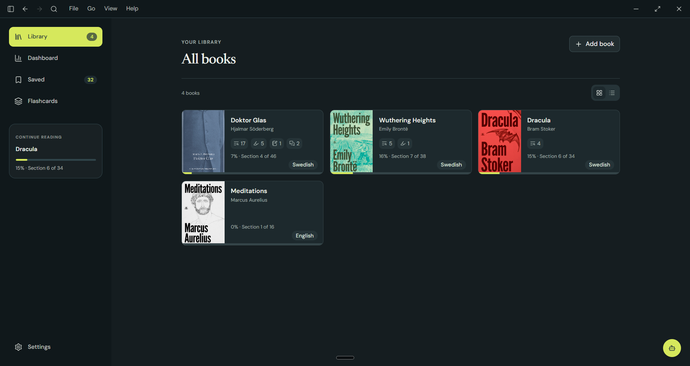
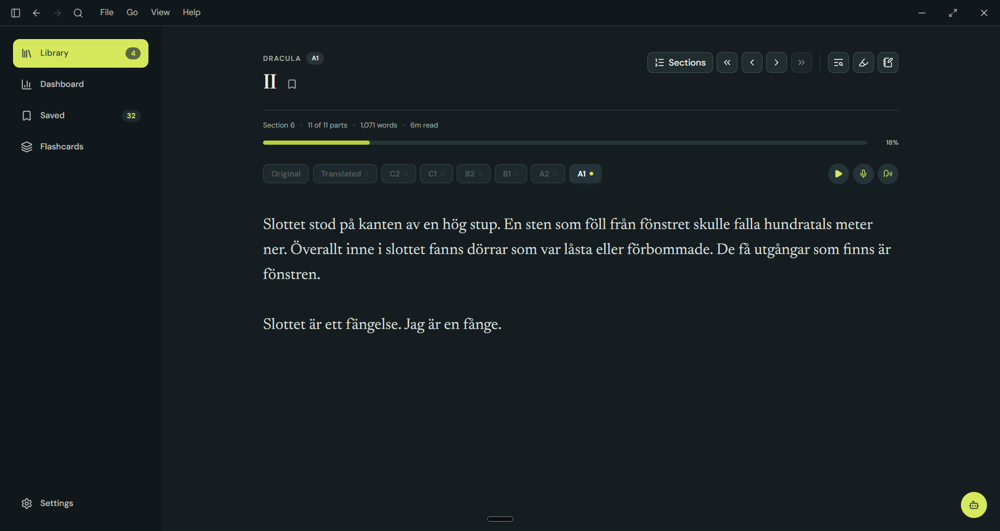
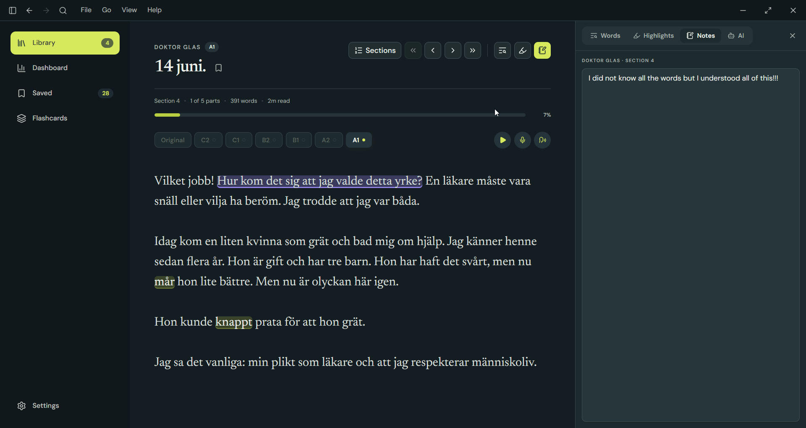
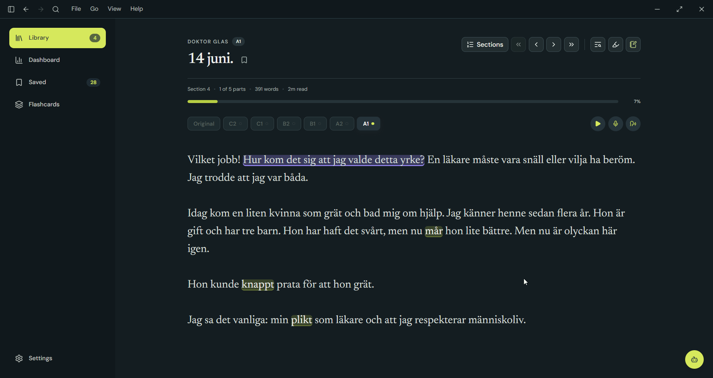
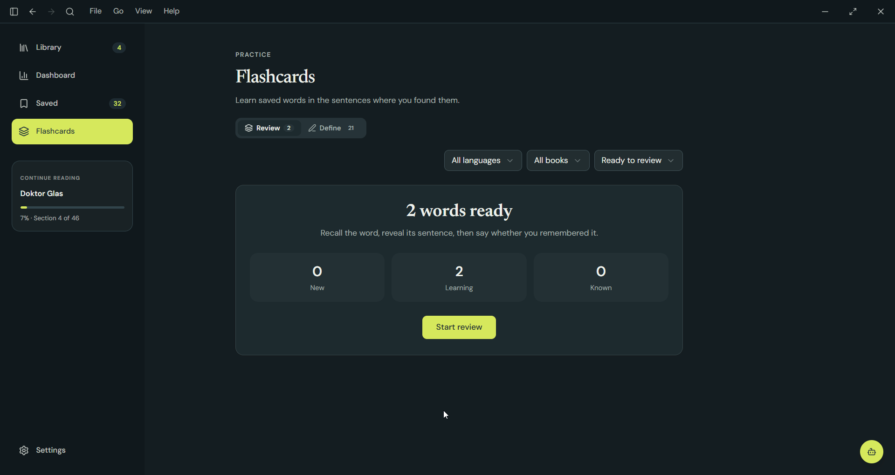
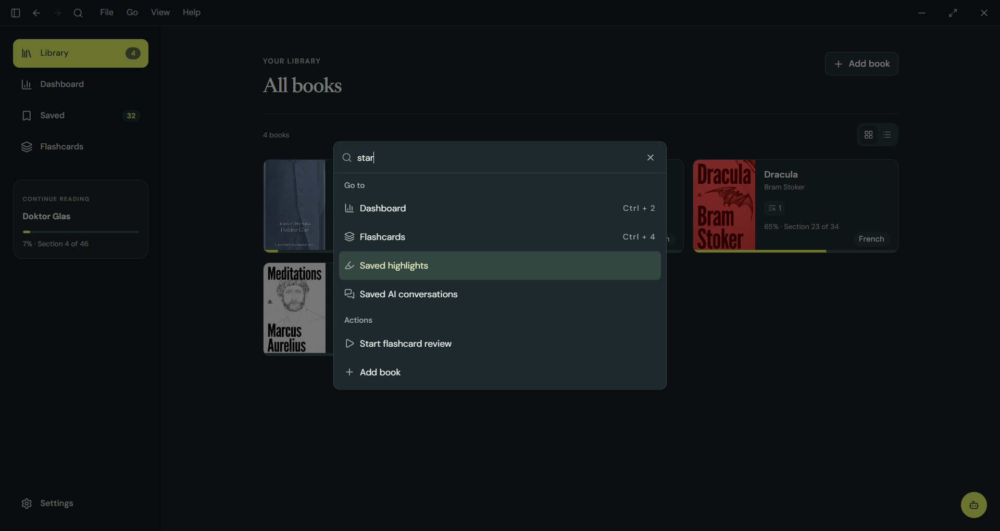
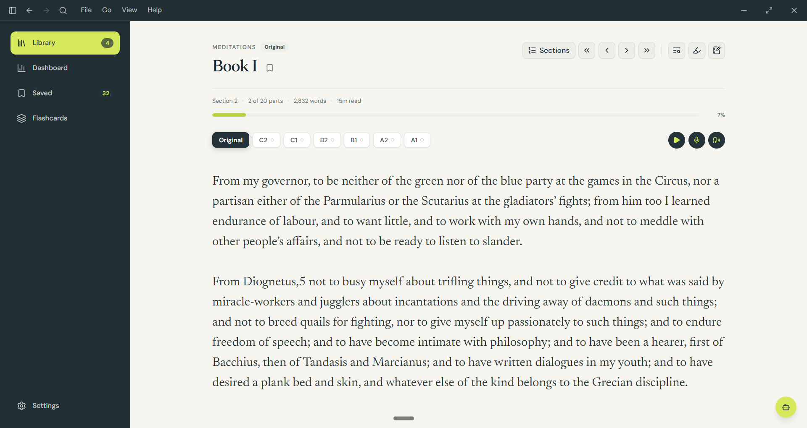

I built this because I want to learn Swedish. There are too many good books in the world that I have yet to read to use boring study materials. So I decided I wanted to bring them down to my level 😇

## Features

You can import any EPUB, or paste plain text or Markdown into Lingon. It doesn't have to be a book, either. You can tag the texts you import as an article, lyrics, a nursery rhyme, or anything your heart desires.

### Translate and adapt to any language and level

Select your level and Lingon will adapt the text so you can read it without too much difficulty. Dracula in Swedish at A1? We got you!

You can translate directly from the original or select your level. If the book is already in your target language, you can always try to read the original. Too hard? Try to bring it down. Was it too easy? Try a level up!

AI generated adaptations are done per chapter. This does a couple of things. It makes sure we are not burning tokens and translating a bunch of stuff you might not even read. It also allows your level to fluctuate as you read through the book.

### Narration, recording and shadowing

You can listen to the book in your target language, record yourself while you read, or put on some headphones to shadow (listen to the book and repeat what you hear).

The recordings are saved as plain files in your file system. You can listen to them in Lingon or in any other program of your choice. You can also send them to a friend to critique your pronunciation and even go through the embarrassment of listening to yourself 😊

### Save for later

#### Word definitions

Click a word to save it. My idea here was to keep it very low friction. As shadowing is my modus operandi, I don't want to worry too much about words I don't understand. If I get the gist of the passage I'm reading, I can save any unknown words to review later without interrupting my flow.

#### Passages

Passages can be highlighted and saved with a note. Both saved passages and words are linked to the exact position in the book, so you can easily go back to look at them in context.

#### Notes

There is also a side panel where you can write notes as you read. They are linked to the book chapter and saved as plain Markdown files in the file system, so your notes are portable and can be accessed from anywhere.

#### AI threads

When in doubt, you can bring in a little bot to help you clarify whatever is confusing you at the moment. 

We have some handy context ready to be sent with your question, including highlighted passages, saved words, notes you've written, or the full chapter.

If you had a good chat and want to save it for later, you can do so. Like everything else, it will be linked to the chapter and level you were reading during the conversation.

Each of these items is available in the sidebar. But you can also view them as collections on a page containing everything you have saved across different chapters, books, and languages.

### Flashcards

Words you save can also be made into flashcards to be reviewed using spaced repetition.

### Keyboard bindings and a command palette

I'm a keyboard person, and I also have poor memory. So I added a command palette with handy shortcuts and keybindings to help me out until muscle memory takes over.

### Other little things

I love little details:

- You can bookmark pages.
- Custom dictionary websites can be configured per language so you can easily look up words without AI.
- In the section menu, you can see which adaptations are available, whether it is bookmarked, and whether there are any saved words, highlights, notes, or AI chats.
- You can see how many words are in each chapter and get an estimated reading time.
- A chapter can be read in parts, so you only get what fits in the viewport, or you can choose scroll mode to have the whole chapter at once.
- You can also select a passage and instead of highlighting it, you can send it directly to the AI, which will add it to your context without saving it.
- AI features are optional and can be disabled. The app is fully functional, and you can still use it to read normally, use system voices for narration, save words, highlights, notes, and so on.

And I almost forgot. We also have light mode ☀️

## Built with

| Layer        | Tech                                                        |
| ------------ | ----------------------------------------------------------- |
| **Frontend** | Vite, React, TypeScript, Tailwind, Zustand                   |
| **Backend**  | Rust + Tauri                                                 |
| **Storage**  | SQLite, Markdown, and local media files                      |
| **AI**       | OpenAI API for adaptations, chat, and generated narration   |

A TypeScript/React front end talks to a Rust core over Tauri's IPC bridge. Rust handles EPUB parsing, filesystem access, SQLite, AI requests, and credentials, while Zustand keeps only temporary UI state. Structured data such as book metadata, reading progress, flashcard scheduling, and conversations lives in SQLite. Content that remains useful outside Lingon (adaptations, notes, flashcards, narration, and recordings) is stored as open Markdown or media files in a library folder you choose.

## What's next?

- **Highlighted passages as flashcards.** The idea here is to give you the opportunity to try to translate passages you chose to review. There is no need to translate them directly—you could instead explain what you understood if you can't translate something exactly, and have an LLM give you feedback on how well you understood the passage.
- **A reading dashboard.** I'm itching to get the dashboard ready. I want to add some traditional NLP analysis for each book and create an algorithm that estimates its complexity and reading level.
