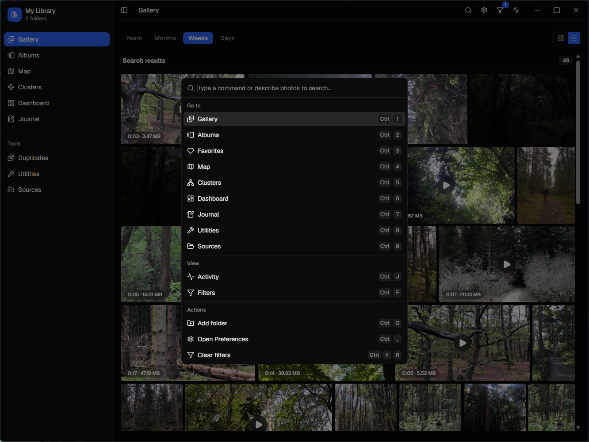
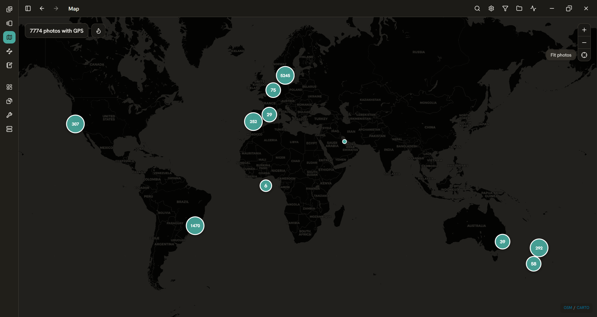
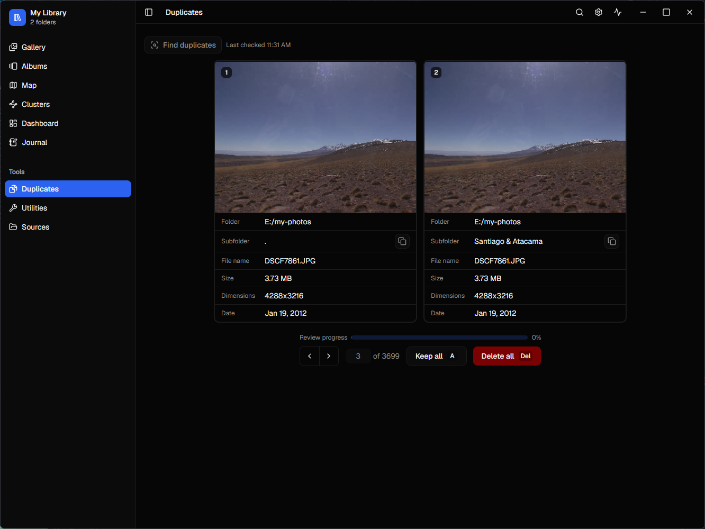
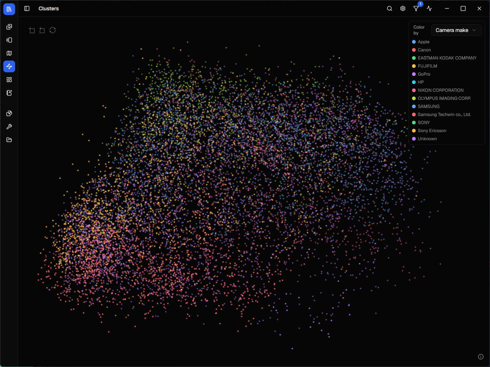
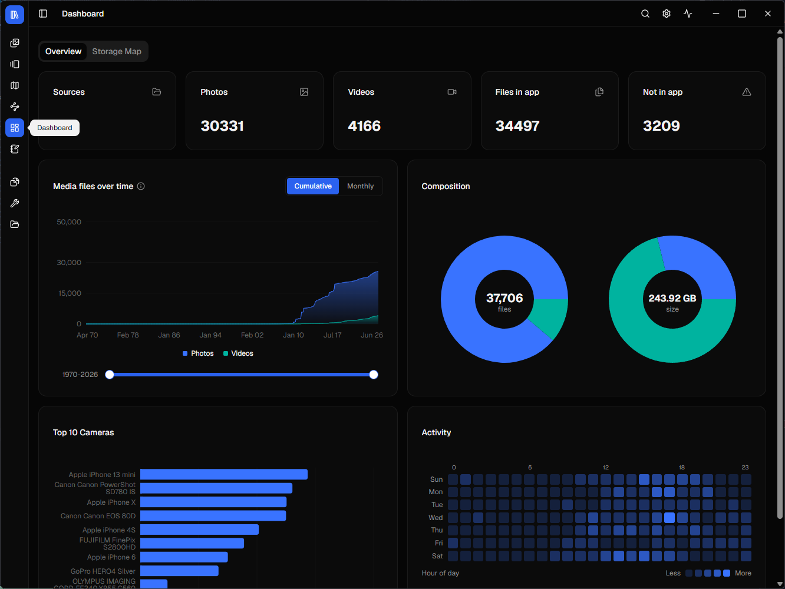
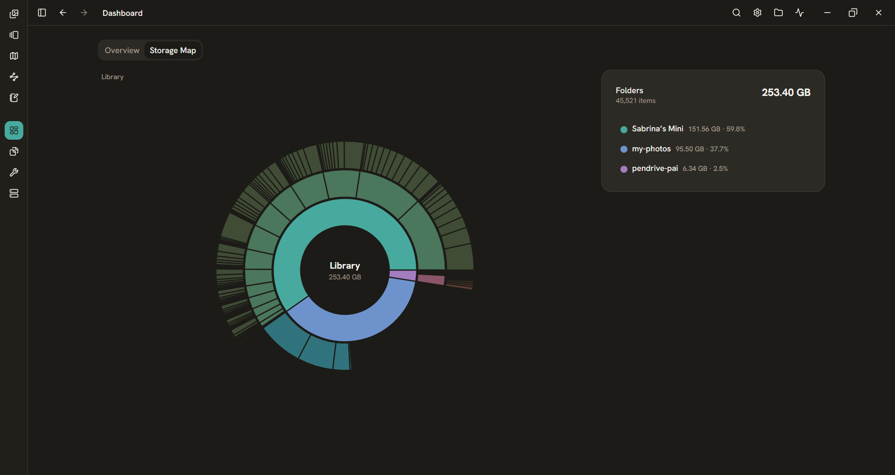
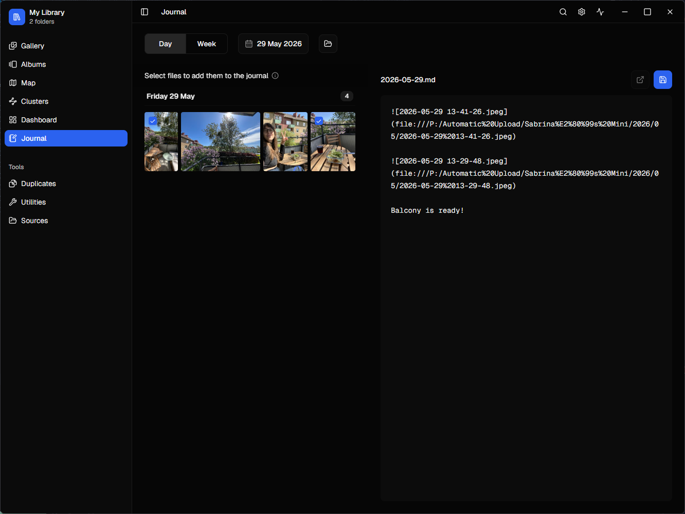
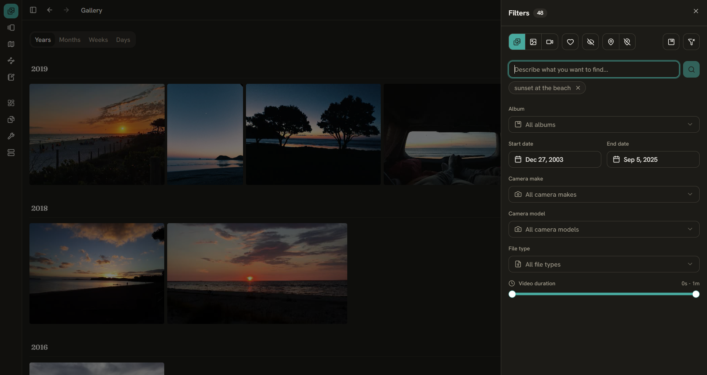
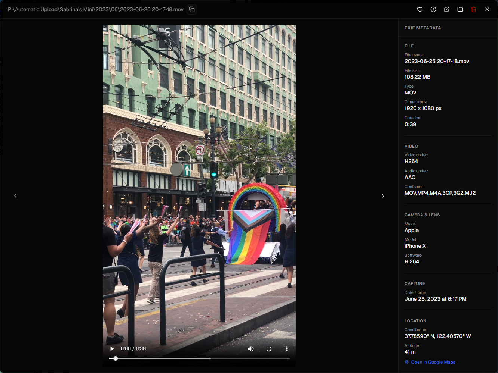

This started because [I just wanted my photos to be files](/blog/photo-gallery/). I searched for a good solution for a long time, but recently gave up and built the photo app I actually wanted. And I'm having a blast doing it.

It's a local-first desktop app for managing a personal photo and video library. You point it at a local or mounted folder and the app indexes everything in place. Browse your timeline, search for photos in natural language, see your photos on a map, clear out duplicates, and keep a journal of the days behind the photos.

<section class="beta-signup" aria-labelledby="photo-gallery-beta-title">
  

    
Private Beta

    <h2 id="photo-gallery-beta-title">Want early access?</h2>
    <!-- 
The app is currently in private beta. Sign up to be notified when more invites become available.
 -->
  

  <button class="beta-signup-trigger" type="button" data-beta-signup-open>Join the waitlist</button>
</section>

<dialog class="beta-signup-modal" aria-labelledby="photo-gallery-beta-modal-title" data-beta-signup-modal>
  <form class="beta-signup-dialog" method="dialog">
    <button class="beta-signup-close" type="button" aria-label="Close beta signup" data-beta-signup-close>×</button>
    

      
Photo Gallery Private Beta

      <h2 id="photo-gallery-beta-modal-title">Join the waitlist</h2>
      
The app is currently in private beta. Sign up to be notified when more invites become available.

    

  </form>
  <form
    class="beta-signup-form"
    method="POST"
    action="https://app.loops.so/api/newsletter-form/cmqld6gzr02hh0jydd2ewj0xk"
    data-bwignore="true"
    data-beta-signup-form
  >
    <input type="hidden" name="mailingLists" value="cmqlf1zzt2bct0jxq6kz5b4nr" />
    <input type="hidden" name="source" value="Photo Gallery website" />
    <label>
      Email*
      <input type="email" name="email" autocomplete="email" data-bwignore="true" required />
    </label>
    

      <label>
        Name
        <input type="text" name="firstName" autocomplete="given-name" data-bwignore="true" />
      </label>
      <fieldset data-beta-os-group>
        <legend>OS*</legend>
        <label>
          <input type="checkbox" value="windows" />
          Windows
        </label>
        <label>
          <input type="checkbox" value="linux" />
          Linux
        </label>
      </fieldset>
    

    <label class="beta-signup-consent">
      <input type="checkbox" required />
      I agree to receive private beta updates by email. Unsubscribe at any time.
    </label>
    <button type="submit">Join</button>
  </form>
  
You’re on the list. I’ll let you know when invites open

  

</dialog>

## Features

The whole idea is that nothing is locked away. Your photos and videos stay as plain files in the folders you choose, the journal is plain markdown you can open in any editor, and the index, albums and embeddings live in a single SQLite database that can be exported as JSON. They're all open formats any tool can read. The AI features run entirely on-device, so there are no accounts and your files never leave your drives.

<!-- IMAGE: hero — full-window screenshot of the gallery grid
 -->

### Command palette & AI search

The app is keyboard-first. Hit the command palette and you can jump to any view, run an action, or just start typing what you're looking for. Search works in plain English, like "dog on the beach", matched against a local CLIP model (ViT-B-32 on ONNX Runtime). It never calls out anywhere; the matching happens on your machine.

<!-- GIF: typing a query and watching results land -->

### Map

Every photo or video that contains GPS coordinates gets plotted on an interactive map, with marker clusters and a heatmap so you can wander the library geographically. Hover a point to see the file it represents.

### Duplicate detection & review

Years of DSLR imports, double backups of things I wasn't sure I'd saved, GoPro footage living in three places at once. You know how it is. The app finds duplicate photos and videos across every folder, even when they're spread over different drives. Keyboard shortcuts make it quick to step through each set and clear out the files you don't want.

<!-- GIF: stepping through the duplicate review flow -->

### Image clustering

Every photo has a CLIP embedding, a high-dimensional vector that captures what's in the shot. Here those vectors are reduced to two dimensions with PCA and laid out as an interactive scatter plot, so visually similar photos end up next to each other.

It renders on ECharts' canvas backend to stay smooth with thousands of points on screen at once. This was the view I really wanted to build, and once the embeddings were there for it, natural-language search came almost for free, since a typed query is just another vector dropped into the same space.

<!-- IMAGE: cluster scatter plot -->

### Dashboard insights

I love data and data visualisation, so of course I built a dashboard that's a little extra. The counts, dates and camera metadata are all fetched directly from the local app database.

<!-- IMAGE: dashboard with charts -->

The dashboard also has a **sunburst chart** of disk usage inspired by Filelight (which I love and use frequently to work out what's eating up my local drive). Each ring is a level of your directory tree, sized by how much space its photos take up, so you can see at a glance which parts of the library are quietly hogging space.

<!-- IMAGE: the folder sunburst / disk-usage chart -->

### Journal

I take photos to document my life, so a journal felt like it belonged right next to them. Daily and weekly entries are saved as plain markdown files. You select a date and the app will give you all the shots for that day or week. Because they're just markdown on disk, you can open and read them anywhere. You can also choose the folder where your journals are saved, so it's perfect if you want to use it with Logseq or Obsidian.

Journaling also turned out to be a great way to curate a library. Writing up your week, you naturally reach for the handful of photos that actually meant something. So instead of trawling through thousands of shots deciding what to *delete*, you quietly build a record of the ones worth *keeping*.

<!-- IMAGE: journal tab with a media picker open -->

### Unified filters

One set of filters stays in sync across every view. Narrow the library down once and the grid, map and clusters all reflect the same selection. You can also save a filtered view straight to a new or existing album.

<!-- IMAGE: filter panel open with the gallery narrowed down -->

### Drives can come and go

Photo libraries exist across drives that aren't always connected. Because thumbnails are cached locally and all the metadata lives in the database, your whole library stays browsable and searchable even when a drive is offline. You can see those photos in your gallery with a badge marking the source as unavailable, and opening one says so instead of failing silently. The Sources tab shows every drive's status, and a quick refresh picks them back up once you reconnect it.

<!-- IMAGE: Sources tab showing connected and offline drives -->

### Library management

The everyday stuff a photo app has to get right. Virtualized grid and timeline views that stay smooth across tens of thousands of files, an EXIF sidebar, albums and favourites. Reveal any file in its folder or open it in your default photo or video app, so the filesystem is always one click away. A filesystem watcher picks up new files automatically, a rescan reconciles anything that changed on disk, and the whole library can be exported to portable JSON whenever you want to walk away.

<!-- IMAGE: grid/timeline view with the EXIF sidebar open -->

## Built with

| Layer        | Tech |
|--------------|------|
| **Frontend** | React, Next.js, TypeScript, Tailwind |
| **Backend**  | Rust + Tauri 2 |
| **Storage**  | SQLite |
| **AI**       | Local CLIP ViT-B-32 via ONNX Runtime |
| **Map** | Leaflet |
| **Plots** | ECharts and Recharts |

A TypeScript/React front end talking to a Rust core over Tauri's IPC bridge. No server, no accounts, no network calls. Recharts handles the small dashboard charts with clean React composition, while the cluster view uses ECharts canvas renderer to stay smooth with thousands of photo points on screen at once.

## Design decisions

### The UI never touches the data

The front end can't read the database or the filesystem directly. Not *won't*, *can't*. Rust owns everything durable: scanning, EXIF, embeddings, every background job. React only renders state and calls through a single bridge module.

Keeping that line strict buys two things. The whole UI becomes replaceable (the Next.js shell could be swapped for a plain Vite app without the core noticing) and the data flow stays easy to follow in one pass.

### Two-phase indexing

Importing a folder happens in two passes. The first is fast: walk the disk, count what's there and record each file so the library is browsable as quickly as possible. The second runs in the background and does the expensive work per photo: EXIF extraction and thumbnails, streaming progress as it goes.

The grid is usable shortly after you point it at a folder, and the workers run in the background without blocking the UI.

### Background jobs that survive a restart

Long-running work like scans, EXIF extraction and embedding generation is tracked as a durable job queue: each task is a row in SQLite with its own status and progress, streamed live to the UI. Because that state lives on disk, jobs are crash-safe. Close the app halfway through embedding 10,000 photos and it picks up exactly where it left off.

### Search that never leaves your machine

Two CLIP models ship with the installer. One encodes your photos into vectors, which is what powers both the cluster plot and natural-language search. The other encodes text into the same vector space. Once the image side existed for clustering, text search came in almost for free. Everything runs on-device; nothing is uploaded, ever.

### Tight file access

The webview can only read the app's own data directory, where thumbnails are cached, never the original folders you add. Full-resolution files are fetched on demand, only when you actually open a photo. It keeps the attack surface small, and it keeps the app ready for Linux, which won't honour broad wildcard file scopes anyway.

### One SQLite file as the index

The index, albums and embeddings all live in a single SQLite file sitting next to your photos. No database server to run, no account, just a file any tool can open. It runs in WAL mode so reads and writes don't fight: the grid keeps scrolling smoothly even while a background scan or embedding job is writing to the same database.

## What's next

Some things I want to build, not necessarily in this order:

- **Face recognition:** on-device face recognition, so you can easily find every photo a person appears in.
- **Share journal entries:** send a journal as an email to family and friends so they can stay up to date without having to sign up to yet another app.
- **UMAP clustering:** swap PCA for UMAP for better cluster separation.
- **GPU acceleration:** run embedding and other heavy work on the GPU where one is available.
- **Plugin system:** users can pick which functionality is enabled.
- **Lasso to filter:** draw over the cluster plot and the map to filter the gallery down to the files in the selected area.
- **Near-duplicate removal:** extend duplicate cleanup beyond exact matches to visually similar shots.
- **Cross-platform releases:** only the Windows build exists today; a Linux build is in the works, and macOS is on the list (anyone got a MacBook I can borrow?).
- **HEIC / HEIF support:** reliably import Apple's iPhone photo format.
