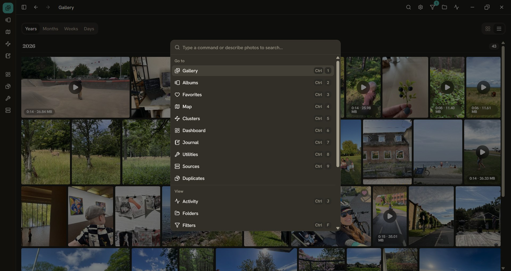
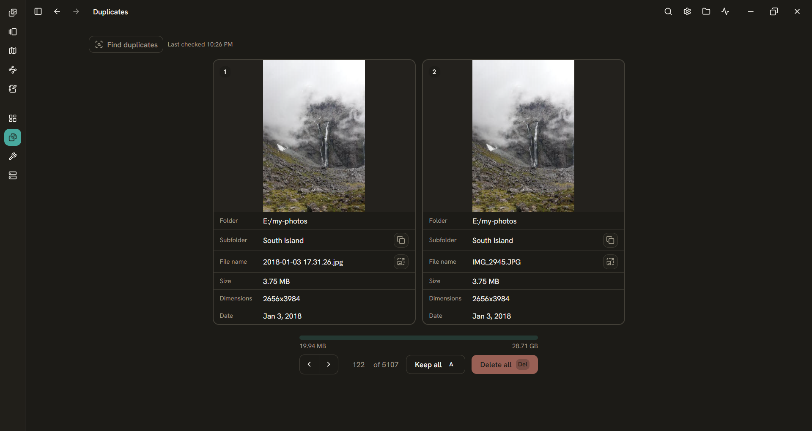

This started because [I just wanted my photos to be files](/blog/photo-gallery/). I searched for a good solution for a long time and never found it, so eventually I gave up and built the photo app I actually wanted. I get to nerd out adding all the features I think belong in an application like this, and I'm having a blast doing it.

It's a local-first desktop app for managing and curating a personal photo and video library. You can add any folder as a source: a local folder, an external drive, or a mounted cloud drive. The app indexes everything in place, without moving your files. Browse your timeline, search in natural language, see your photos on a map, clear out duplicates across drives, and keep a journal of the days behind the photos.

<section class="beta-signup" aria-labelledby="photo-gallery-beta-title">
  

    
Private Beta

    <h2 id="photo-gallery-beta-title">Want early access?</h2>
    <!-- 
The app is currently in private beta. Sign up to be notified when more invites become available.
 -->
  

  <button class="beta-signup-trigger" type="button" data-beta-signup-open>Join the waitlist</button>
</section>

<dialog class="beta-signup-modal" aria-labelledby="photo-gallery-beta-modal-title" data-beta-signup-modal>
  <form class="beta-signup-dialog" method="dialog">
    <button class="beta-signup-close" type="submit" aria-label="Close beta signup" data-beta-signup-close>×</button>
    

      
Photo Gallery Private Beta

      <h2 id="photo-gallery-beta-modal-title">Join the waitlist</h2>
      
The app is currently in private beta. Sign up to be notified when more invites become available.

    

  </form>
  <form
    class="beta-signup-form"
    method="POST"
    action="https://app.loops.so/api/newsletter-form/cmqld6gzr02hh0jydd2ewj0xk"
    novalidate
    data-bwignore="true"
    data-beta-signup-form
  >
    <input type="hidden" name="mailingLists" value="cmqlf1zzt2bct0jxq6kz5b4nr" />
    <input type="hidden" name="source" value="Photo Gallery website" />
    <label>
      Email*
      <input type="email" name="email" autocomplete="email" data-bwignore="true" required />
    </label>
    

      <label>
        Name
        <input type="text" name="firstName" autocomplete="given-name" data-bwignore="true" />
      </label>
      <fieldset data-beta-os-group>
        <legend>OS*</legend>
        <label>
          <input type="checkbox" value="windows" />
          Windows
        </label>
        <label>
          <input type="checkbox" value="linux" />
          Linux
        </label>
      </fieldset>
    

    <label class="beta-signup-consent">
      <input type="checkbox" required data-beta-signup-consent />
      I agree to receive private beta updates by email. Unsubscribe at any time.
    </label>
    

      <button type="submit" disabled>Join</button>
      
You’re on the list 🎉

      

    

  </form>
</dialog>

## Features

The whole idea is that you own your data: not only the original files, but also the metadata you create while organising them. Your photos and videos stay as plain files in the folders you choose, and the journal is plain markdown you can open in any editor. The local index, albums, and embeddings live in SQLite, while your paths, EXIF metadata, favourites, albums, and library summary can be exported as human-readable JSON. The AI features run entirely on-device, so your photos are never uploaded for processing and there is no account or cloud backend to depend on.

<!-- NEW SCREENSHOT: Hero — a polished full-window gallery view with the sidebar visible.
Use a visually varied library, a populated timeline/grid, and no modal covering the interface.
Replace photo-gallery-main.jpg, then uncomment the image below.
 -->

### Command palette & AI search

The app is keyboard-first. Open the command palette to jump to any view, run an action, or start typing what you're looking for. Search works in plain English, like "dog on the beach", matched against a local CLIP model (ViT-B-32 on ONNX Runtime). The same search is also available alongside the global filters. The matching happens on your machine.

<!-- NEW SCREENSHOT OR GIF: Open command palette with a natural-language query and visible matching
results. Replace photo-gallery-command-palette.png. A short GIF would be even better. -->

### Map

Every photo or video that contains GPS coordinates gets plotted on an interactive map, with marker clusters and a heatmap so you can wander the library geographically. Hover a point to see the file it represents.

<!-- NEW SCREENSHOT: Map showing the Copenhagen bike-trip album filter, with the album filter visible
and enough markers to make the geography interesting. Replace photo-gallery-map.png. -->

### Duplicate detection & review

Years of DSLR imports, double backups of things I wasn't sure I'd saved, GoPro footage living in three places at once. You know how it is. The app finds exact, content-matched duplicate photos and videos across every source, even when they're spread over different drives. Keyboard shortcuts make it quick to step through each set and clear out the files you don't want.

<!-- NEW SCREENSHOT OR GIF: Duplicate resolver with one group selected, files from two different
source drives, and the keyboard-driven workflow visible. Replace photo-gallery-duplicates.png. -->

### Image clustering

Once embedding generation is enabled, each processed photo gets a CLIP embedding: a high-dimensional vector that captures what's in the shot. Those vectors are reduced to two dimensions with PCA and laid out as an interactive scatter plot, with every photo and video thumbnail projected into the space so visually similar things end up next to each other.

It renders on ECharts' canvas backend to stay smooth with thousands of points on screen at once. This was the view I really wanted to build, and once the embeddings were there for it, natural-language search came almost for free, since a typed query is just another vector dropped into the same space.

<!-- NEW SCREENSHOT: Cluster view zoomed to a visually legible set of groups, with real thumbnails
and the surrounding app chrome visible. Replace photo-gallery-clusters.png. -->

### Dashboard insights

I love data and data visualisation, so of course I built a dashboard that's a little extra. The counts, dates and camera metadata are all fetched directly from the local app database.

<!-- NEW SCREENSHOT: Dashboard overview including the cumulative media-library growth chart.
Choose a library with enough history for the chart to tell a story. Replace photo-gallery-dash.png. -->

The dashboard also has a **sunburst chart** of disk usage inspired by Filelight (which I love and use frequently to work out what's eating up my local drive). Each ring is a level of your directory tree, sized by how much space its photos take up, so you can see at a glance which parts of the library are quietly hogging space.

<!-- NEW SCREENSHOT: Drill into the storage-map sunburst so its hierarchy and labels are readable.
Replace photo-gallery-dash-sunburst.png. -->

### Journal

I take photos to document my life, so a journal felt like it belonged right next to them. You choose a day or week and the app gives you all the photos and videos from that period, plus some space to write. Select the ones you want to remember and they're added to the entry as markdown image embeds.

The resulting file is completely independent of the app. You choose where the markdown files are written, and you can open them in any editor. Mine live in my Obsidian vault.

Journaling also turned out to be a great way to curate a library. Writing up your week, you naturally reach for the handful of photos that actually meant something. So instead of trawling through thousands of shots deciding what to _delete_, you quietly build a record of the ones worth _keeping_.

<!-- NEW SCREENSHOT: Journal in week mode with the date-range media picker populated, a short entry,
and several selected images rendered as markdown embeds. Replace photo-gallery-journal.png. -->

### Unified filters

One set of filters stays in sync across every view. Narrow the library down once and the grid, map, clusters, and folder views all reflect the same selection. Albums are a filter too, which means I can pick my recent bike trip and immediately get a map of Copenhagen. You can also save a filtered view straight to a new or existing album.

<!-- NEW SCREENSHOT: Filters sheet open with an album selected and visibly narrowed results.
Use the same Copenhagen bike-trip album as the map shot. Replace photo-gallery-filters.png. -->

### Drives can come and go

Photo libraries exist across drives that aren't always connected. Because thumbnails are cached locally and the metadata lives in the database, your library stays browsable and searchable when a drive is offline. You can see those photos in the gallery with a badge marking the source as unavailable, and opening one explains what happened instead of failing silently. The Sources tab shows every drive's status, and a rescan reconciles changes when you reconnect it. This is especially useful for mounted cloud drives, where filesystem notifications can be a little unpredictable.

<!-- NEW SCREENSHOT: Sources tab containing at least one connected source and one unavailable
external or mounted drive, with their status badges clearly visible. Add a new image reference here. -->

### Library management

The everyday stuff a photo app has to get right. Virtualized grid and timeline views that stay smooth across tens of thousands of files, an EXIF sidebar, albums and favourites. Reveal any file in its folder or open it in your default photo or video app, so the filesystem is always one click away. A filesystem watcher picks up new files automatically, a rescan reconciles anything that changed on disk, and the whole library can be exported to portable JSON whenever you want to walk away.

<!-- NEW SCREENSHOT: Timeline or grid with the media viewer/EXIF panel open on a strong photo.
Include useful camera metadata and, if possible, a video elsewhere in the grid.
Replace photo-galleryexif-vid.png; consider renaming it to photo-gallery-exif.png. -->

## Built with

| Layer        | Tech                                      |
| ------------ | ----------------------------------------- |
| **Frontend** | Vite, React, TypeScript, Tailwind         |
| **Backend**  | Rust + Tauri                              |
| **Storage**  | SQLite                                    |
| **AI**       | Local CLIP ViT-B-32 with ONNX Runtime     |
| **Map**      | Leaflet                                   |
| **Plots**    | ECharts and Recharts                      |

A TypeScript/React front end talks to a Rust core over Tauri's IPC bridge. There is no server or account, and the library and AI processing stay local. The map does fetch its tiles and place data from public map services. Recharts handles the dashboard charts with clean React composition, while the cluster view uses ECharts' canvas renderer to stay smooth with thousands of photo points on screen at once.

## Design decisions

### The UI never touches the data

The front end can't read the database or the filesystem directly. Not _won't_, _can't_. Rust owns everything durable: scanning, EXIF, embeddings, every background job. React only renders state and calls through a single bridge module.

Keeping that line strict buys two things. The Vite/React UI stays replaceable without the Rust core noticing, and the data flow remains easy to follow in one pass.

### Two-phase indexing

Importing a folder happens in two passes. The first is fast: walk the disk, count what's there, and record each file so the library is browsable as quickly as possible. The second runs in the background and does the expensive work: metadata extraction, previews, content hashes, and, when enabled, embeddings. It streams progress as it goes.

The grid is usable shortly after you point it at a folder, and the workers run in the background without blocking the UI.

### Background jobs that survive a restart

Long-running work like scans, metadata extraction, and embedding generation is tracked in SQLite, with status and progress streamed live to the UI. Preparation and embedding work can be paused and resumed, and the database keeps enough per-file state to work out what is still missing after a restart. I would much rather recalculate a little work than leave a 10,000-photo library in a mysterious half-finished state.

### Search that never leaves your machine

Two CLIP models power search. One encodes your photos into vectors, which drives both the cluster plot and natural-language search. The other encodes text into the same vector space. Once the image side existed for clustering, text search came almost for free. Everything runs on-device; nothing is uploaded for processing.

### Tight file access

The webview has no general filesystem permission. Folders are granted through the native OS picker, canonicalised by Rust, registered as sources, and then given narrowly scoped runtime access so the app can display their media. It cannot ask to read an arbitrary path. Export destinations go through the native save dialog for the same reason.

### One SQLite file as the index

The index, albums, jobs, and embeddings all live in a single SQLite file in the app's data directory. There is no database server to run and no account to create. It runs in WAL mode so reads and writes don't fight: the grid keeps scrolling smoothly even while a background scan or embedding job is writing to the same database. The organisational layer can also be exported as human-readable JSON.

## What's next

Some things I want to build, not necessarily in this order:

- **Face recognition:** on-device face recognition, so you can easily find every photo a person appears in.
- **Share journal entries:** send a journal as an email to family and friends so they can stay up to date without having to sign up to yet another app.
- **UMAP clustering:** swap PCA for UMAP for better cluster separation.
- **GPU acceleration:** run embedding and other heavy work on the GPU where one is available.
- **Plugin system:** optional features can already be switched on and off; the next step would be a real extension system for adding third-party functionality.
- **Lasso to filter:** draw over the cluster plot and the map to filter the gallery down to the files in the selected area.
- **Near-duplicate removal:** extend duplicate cleanup beyond exact matches to visually similar shots.
- **Cross-platform releases:** Windows is the main build today and Linux AppImage builds are now working; macOS is still on the works.
- **Full HEIC / HEIF support:** these files can already be indexed with their dates, EXIF, and GPS metadata, but full previews and conversion still need more love.
